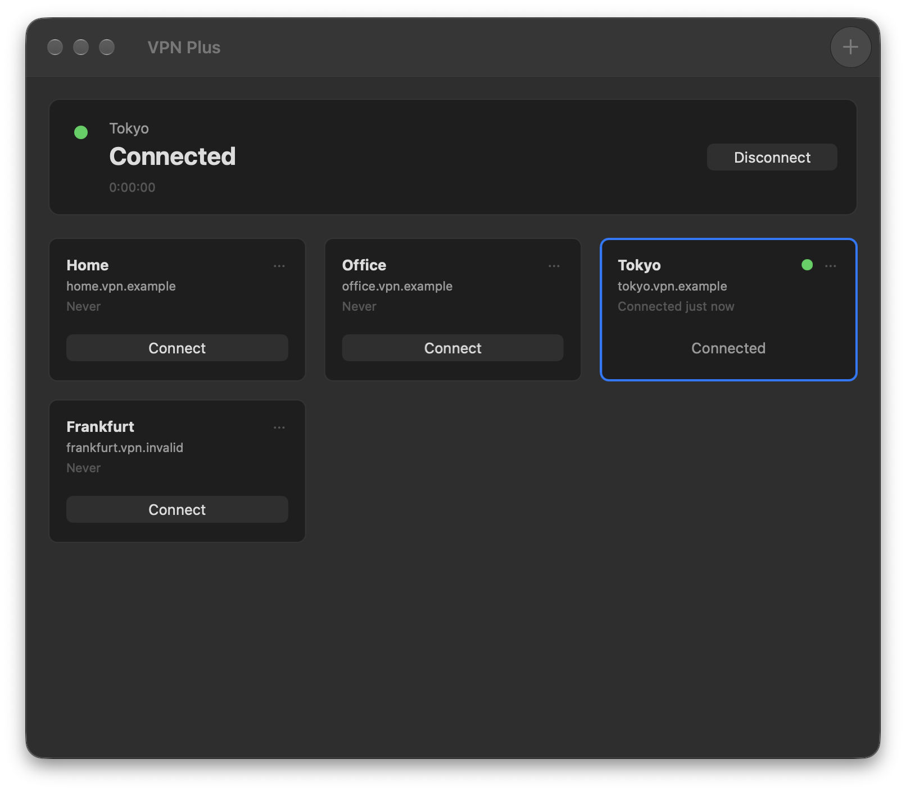
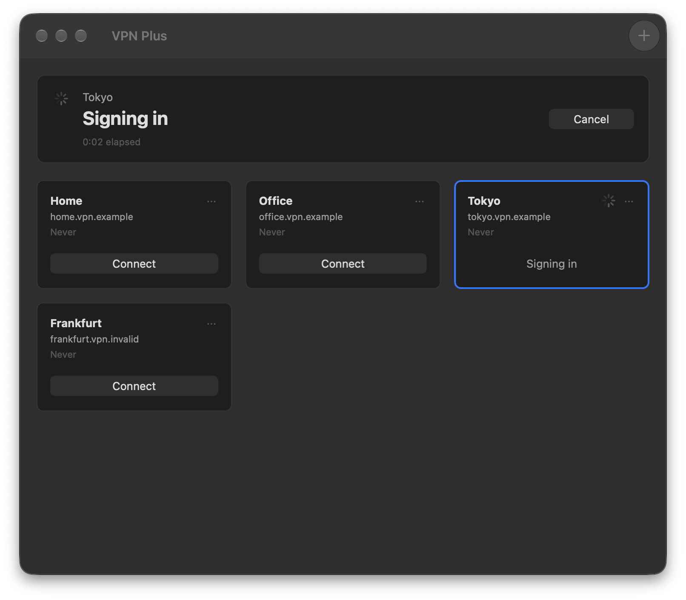
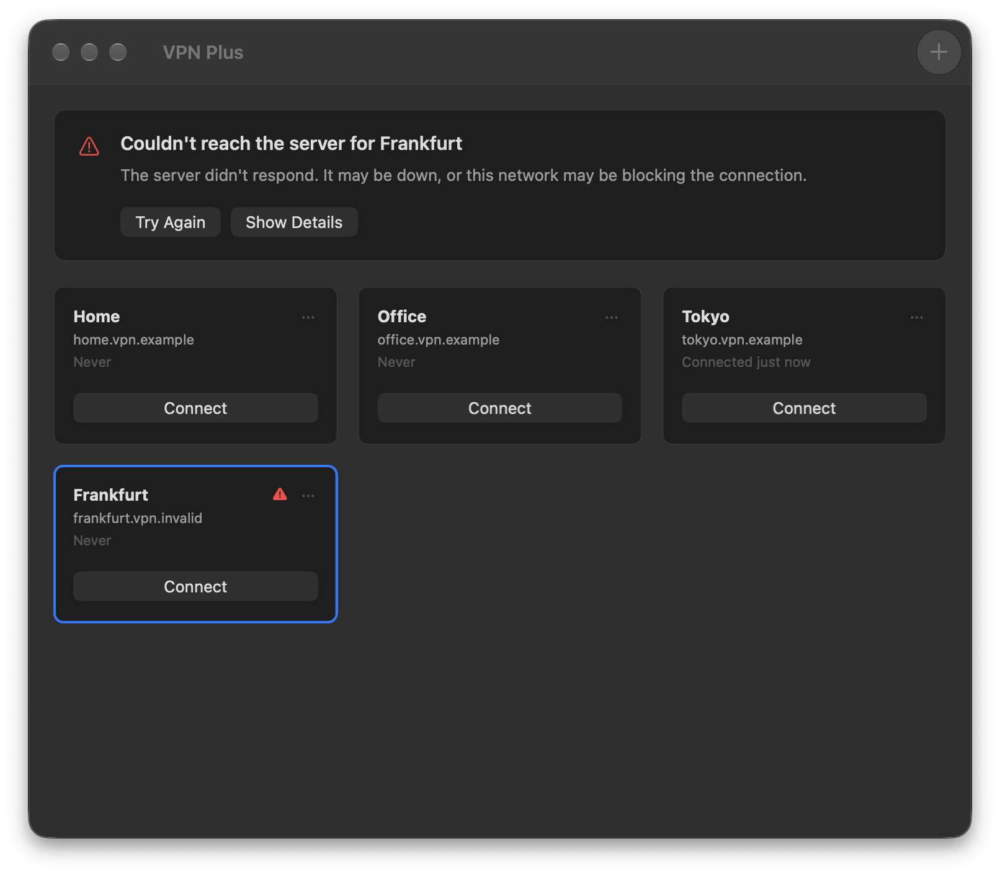
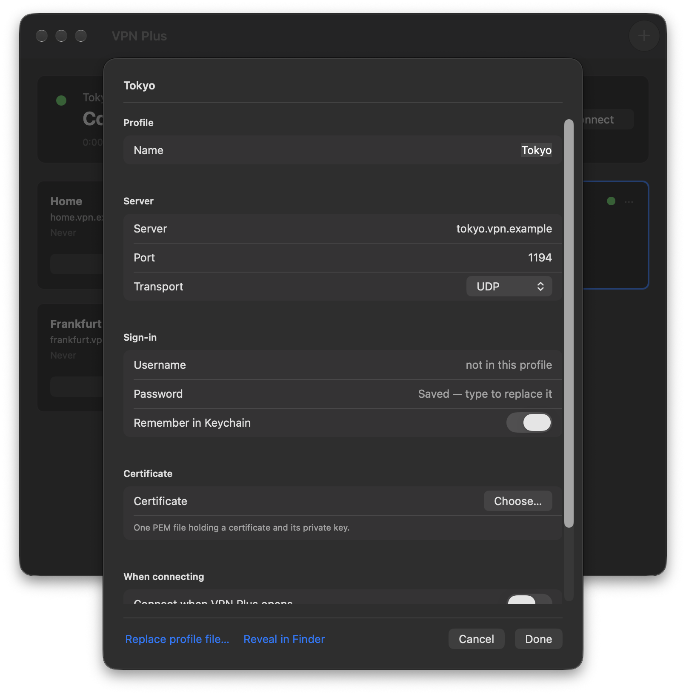
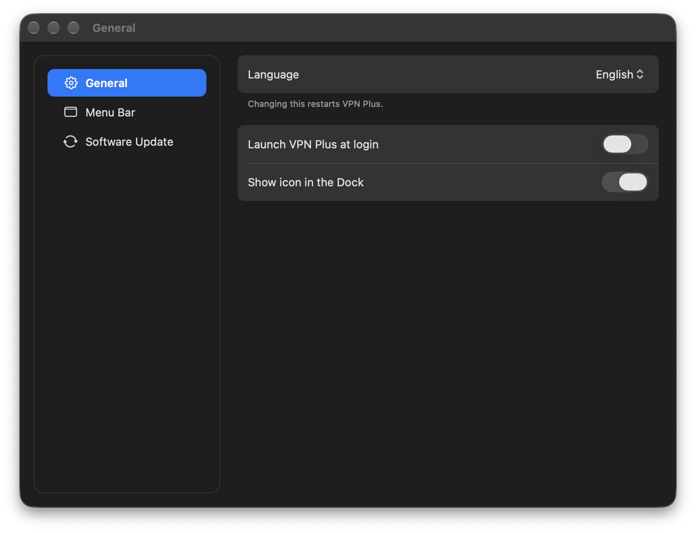

# VPN Plus

A native macOS client for **OpenVPN** servers, designed interface-first.

OpenVPN on the Mac is a solved problem technically and an unsolved one
experientially. VPN Plus is written from scratch around one idea: connecting,
switching and finding out what went wrong should each be obvious.

- **Swift 6** + AppKit, async/await, strict concurrency
- The **[OpenVPN 3](https://github.com/OpenVPN/openvpn3)** core library, in a
  NetworkExtension system extension — the way macOS wants a VPN built
- Universal binary (Apple Silicon + Intel), Developer ID-signed and notarized
- Six languages, switchable in Settings



<table>
  <tr>
    <td width="50%">
      <br>
      <sub><b>Connecting names its step</b> — and every step has a time limit</sub>
    </td>
    <td width="50%">
      <br>
      <sub><b>Failures in plain language</b> — what failed, and what to do about it</sub>
    </td>
  </tr>
  <tr>
    <td width="50%">
      <br>
      <sub><b>Profile settings</b> — server, sign-in and certificate; the password in your Keychain</sub>
    </td>
    <td width="50%">
      <br>
      <sub><b>Settings</b> — six languages, switchable in the app</sub>
    </td>
  </tr>
</table>

## Install

Download the latest `VPNPlus-x.y.z.dmg` from
[Releases](https://github.com/BossaGroove/VPNPlus/releases/latest), open it,
and drag **VPN Plus** into Applications. It keeps itself up to date via
Sparkle (Settings → Software Update).

The first time it opens, macOS asks for permission before any app can create
a VPN connection: you turn VPN Plus on in System Settings, enter your Mac's
password, and allow it to add a VPN configuration. VPN Plus explains each step
before it happens and notices when you are done. It is once per Mac.

Then import a `.ovpn` profile — the file your VPN provider, your employer or
your own server gave you — by dragging it onto the window.

Requires **macOS 14 (Sonoma) or later**.

## Features

- **One window, one click**: every profile is a card; Connect connects it, and
  connecting to another profile while one is up switches in a single step.
- **Profiles**: import by drag, File › Import Profile… or double-click in the
  Finder, checked at import so a problem is explained then, not at connect.
  Rename, remove, or replace a profile's file and keep your settings. Choose
  the server, set the username or use a different certificate — every value
  says whether it came from the profile or from you, with a one-click revert.
- **Passwords in the macOS Keychain**, with each profile's certificate and
  key — never in a file. Removing a profile removes them.
- **Connecting names its step** — finding the server, contacting it, signing
  in, setting up your connection — and every step has a time limit. When one
  runs out, VPN Plus says which step didn't finish instead of spinning.
- **Failures in plain language**, in the main window: what failed and what to
  do about it, never a raw error code.
- **Stays connected** through sleep and wake, a change of Wi-Fi, and a lost
  network, reconnecting with growing pauses and saying so if it gives up.
- **Diagnostics you can send**: what changed on this Mac since the profile
  last connected, a timeline of every attempt with each step's timing, and
  Copy or Export — with passwords and keys removed.
- **A menu bar icon** that shows the state at a glance and always agrees with
  the window; its menu connects, switches, disconnects and quits.
- **Localized**: English, 日本語, 繁體中文, 简体中文, Deutsch, Français.

Not supported yet: profiles that keep their certificate in a PKCS#12
keystore, and profiles that download their settings from the server after you
sign in. VPN Plus recognises both at import and says so.

## Why another VPN client

Two clients cover OpenVPN on the Mac, and they miss in opposite directions.

**Tunnelblick** is capable, open source, and has kept a lot of people
connected for a long time — but its interface is from another era: small
text, several windows, and a great deal on screen that competes with the two
things most people actually came to do.

**OpenVPN Connect** goes the other way: a small window that shows very
little, and almost nothing when a connection fails. A tunnel that cannot
establish can sit on "connecting" indefinitely — no step, no error, no
timeout. Switching to a different saved profile takes a menu, a list, and a
button labelled something other than what it does.

VPN Plus is a third answer, built on the premise that the interface is the
hard part:

- **One window.** Everything routine happens in it.
- **Switching profiles is one click**, from the main screen.
- **State is never a lie.** "Connecting" names the step it is on, and times
  out with a reason.
- **Failures are legible** — what failed, and what to do about it, in plain
  language, without opening a log viewer.
- **A menu bar item you can trust at a glance**, always agreeing with the
  window.

VPN Plus speaks OpenVPN first. The protocol sits behind a single boundary, so
that others — WireGuard next — are an addition rather than a rewrite.

## Privacy

VPN Plus has no account and no analytics. The only connections it makes are
to your VPN server and, to check for updates, to this repository's releases.
Passwords, private keys and passphrases live in the macOS Keychain, and the
diagnostics it lets you copy or export have them removed.

## Building from source

Needs Xcode and [XcodeGen](https://github.com/yonaskolb/XcodeGen)
(`brew install xcodegen`).

```bash
git submodule update --init       # OpenVPN 3, pinned at a release tag
Scripts/build-deps.sh             # OpenSSL, lz4, fmt and patched asio — static, universal; once
xcodegen generate
xcodebuild -project VPNPlus.xcodeproj -scheme VPNPlus \
  -configuration Debug -destination 'platform=macOS' \
  CODE_SIGNING_ALLOWED=NO build
```

The Xcode project is generated — edit `project.yml`, never the pbxproj. The
protocol-agnostic core has its own suite,
`swift test --package-path Packages/VPNPlusCore`; the engine's runs with
`xcodebuild … test`. An unsigned build runs, but macOS only lets a signed and
approved system extension carry traffic, so connecting needs a build signed
with your own Apple Developer account.

## License

**GPL-3.0-or-later.** See [LICENSE](LICENSE).

VPN Plus is built on the OpenVPN 3 core library, which is dual-licensed
AGPL-3.0-only or MPL-2.0; we use it under the **MPL-2.0** arm, combined into
this GPL-3.0 work as MPL-2.0 §3.3 permits. Everything else it ships with —
OpenSSL 3 (Apache-2.0), asio (BSL-1.0), lz4 (BSD-2-Clause), {fmt} (MIT) and
Sparkle (MIT) — is compatible with GPL-3.0. Their notices and licence texts
are in [THIRD_PARTY_NOTICES.md](THIRD_PARTY_NOTICES.md), and in the app under
About VPN Plus.

## Credits

VPN Plus is a from-scratch implementation, but it owes its understanding of
the problem to the projects that got there first — most of all
[Tunnelblick](https://tunnelblick.net) and
[OpenVPN](https://openvpn.net). Thank you.

"OpenVPN" is a trademark of OpenVPN Inc. VPN Plus is an independent project,
not affiliated with or endorsed by OpenVPN Inc.
